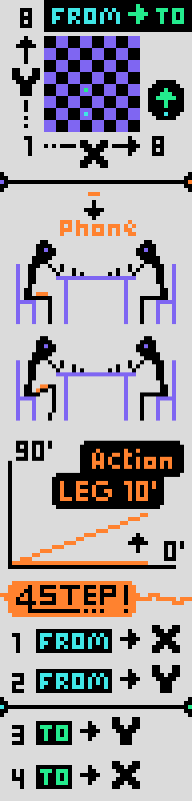

# Chess Cheat

The Chess Cheat app is designed to assist you in chess by providing the best moves. Please note that using this app in tournaments is unethical and strongly discouraged (in any case with a timer it's extremely difficult to win). The app operates by transmitting your opponent's move to a bot when you discreetly move your leg, and then it signals the best move for you to make via vibrations.

https://snack.expo.dev/@robin.bigeard/chess-cheat?platform=mydevice

## Play the move of the opponent

When it's your opponent's turn, transcribe the action to the bot, giving the starting position `FROM` with X and Y and the final position of the piece `TO`, X and Y. Once the action has been transcribed to the bot, it returns the best movement (the data comes from a StockFish server that you can find in `./stockfish-server`). 

> How do I perform an action?  

Simply raise your leg by 10 degrees. Then select a position between 1 and 8. Vibrations are emitted for the count. After you need to come back 0 degree and wait 1 second to validate (you must perform this action 4 times for the `FROM` and `TO`).

## Play the move of the bot ("best move")

When is the turn of the bot, a request is sent to the server to ask for the best action to do. Once the data has been intercepted, the script will perform a 4-step vibration sequence with `FROM` with X and Y and `TO`, X and Y. It is then up to you to make the movement on the board. 

Good luck to you :) - future king of chess (without a timer).

## Dev

- Start the app:

`npm i`  
`npm start`

And use Expo Go or else.

- Start your own server StockFish (stockfish.js / WASM / POPCNT)

`npm i`  
`npm start`

And change URL in `App.tsx` (HTTP POST request).

## Thanks

Thanks @akshitkrnagpal - Akshit Kr Nagpal  
For the chess board :  
https://github.com/akshitkrnagpal/chess-app

And thanks @hyugit  
For stockfish-server:  
https://github.com/hyugit/stockfish-server
